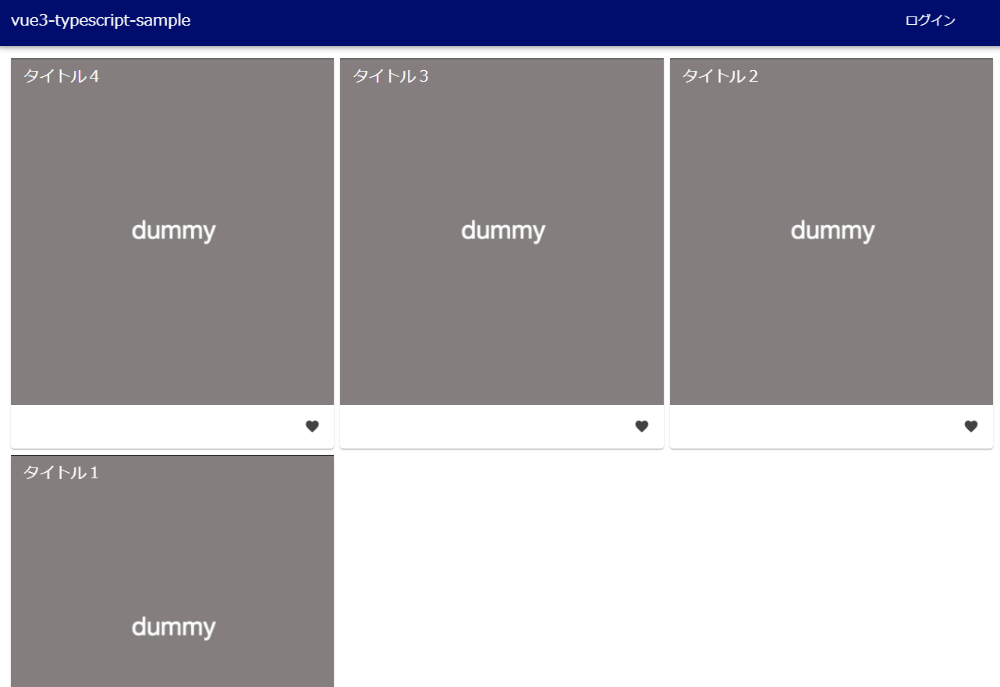
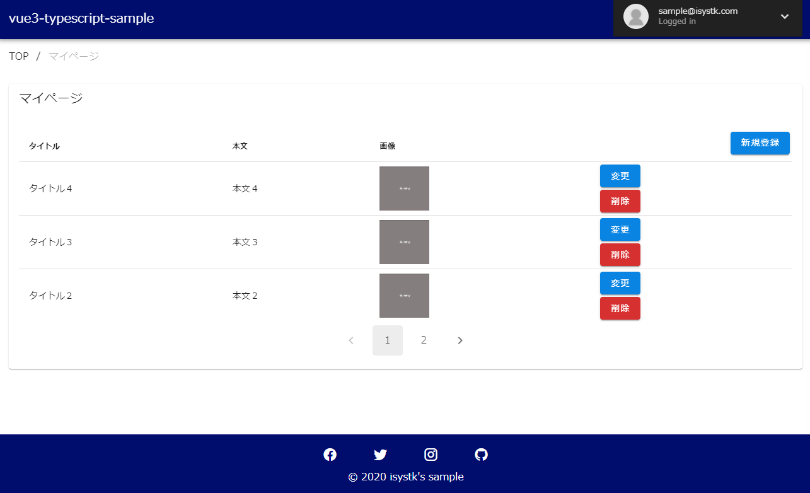
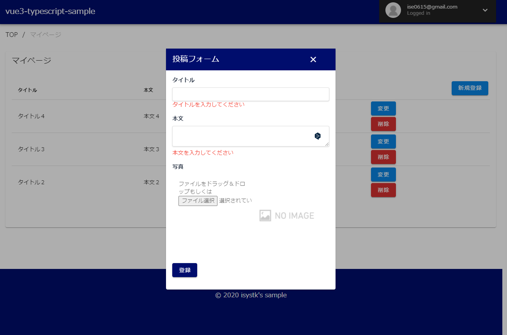

🌙 vue3-typescript-sample
====


## 📗 プロジェクトの概要

Vue3 の学習用サンプルアプリケーションです。


### 利用している技術

- Vue3
- Typescript
- Tailwind Css
- Vuetify 
- Cognito

## 🌐 Demo
https://dev.d28qg1769uc44q.amplifyapp.com






## 🔧  Node.js のバージョン
```shell
$ node -v
v16.13.1
```

## 📦 ディレクトリ構造

```

```


## 🖊️ 起動方法

```shell
$ yarn
$ yarn dev
```

## 💬 使い方
```shell
# run test
$ yarn test

# run lintfix & prettier
$ yarn fix

# run storybook
$ yarn storybook
```

## 🎨 参考

| プロジェクト| 概要|
| :---------------------------------------| :-------------------------------|
| [Vuetify 3 Beta](https://next.vuetifyjs.com/en/getting-started/installation/)| Vuetify 3 Beta |
| [Tailwind CSS](https://tailwindcss.com/docs/installation)| Tailwind CSS |

## 🎫 Licence

[MIT](https://github.com/isystk/vue3-typescript-sample/blob/master/LICENSE)

## 👀 Author

[isystk](https://github.com/isystk)

